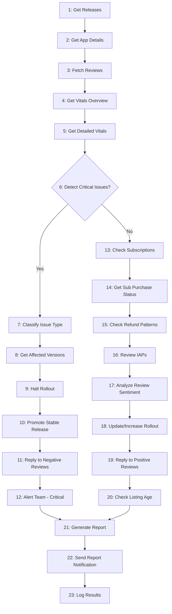

# Play Store MCP Agent Workflow Documentation

This document describes the structure, execution flow, and step-by-step logic of the **Play Store MCP Agent Workflow**. 

The workflow is defined in [PlayStore_Agent_Workflow.yml](file:///c:/Users/K.Arunadevi/Google%20Playstore/PlayStore_Agent_Workflow.yml) and is structured flatly to enable autonomous AI agents to parse and run it step-by-step.

---

## ⚙️ Global Configuration & Variables

These variables configure the global environment and alerts:

| Key | Description | Default / Format |
|---|---|---|
| `workflow_id` | Unique ID of the monitoring workflow | `playstore_monitor_2025` |
| `app_id` | Package name of the target Android app | `${APP_ID}` (e.g., `com.example.app`) |
| `crash_rate_threshold` | Crash rate percentage triggering a critical alert | `2.0` (2%) |
| `anr_rate_threshold` | ANR rate percentage triggering a critical alert | `0.5` (0.5%) |
| `negative_review_threshold` | Number of ratings <= 2 stars triggering critical handler | `3` reviews |
| `frequency` | Running schedule interval | `daily` |
| `run_time` | Running schedule execution time | `02:00 UTC` |

### Notifications Configurations
- **Recipients**: `team@example.com`
- **Slack Channel**: `#playstore-monitoring`
- **Email Report Enabled**: `true`
- **Slack Alert Enabled**: `true`

---

## 📈 Execution Flow

---

## 📝 Step-by-Step Reference

### 1. Get Current Release Status
* **Step ID**: `1`
* **MCP Tool**: `get_releases`
* **Parameters**:
  - `package_name`: `${APP_ID}`
* **Output**: Stores track information in `current_releases` variable.
* **Next**: Step `2`.

### 2. Get App Details
* **Step ID**: `2`
* **MCP Tool**: `get_app_details`
* **Parameters**:
  - `package_name`: `${APP_ID}`
* **Output**: Stores application metadata in `app_details` variable.
* **Next**: Step `3`.

### 3. Fetch Recent Reviews
* **Step ID**: `3`
* **MCP Tool**: `get_reviews`
* **Parameters**:
  - `package_name`: `${APP_ID}`
  - `max_results`: `50`
* **Output**: Stores reviews list in `recent_reviews` variable.
* **Next**: Step `4`.

### 4. Get App Vitals Overview
* **Step ID**: `4`
* **MCP Tool**: `get_vitals_overview`
* **Parameters**:
  - `package_name`: `${APP_ID}`
* **Output**: Stores stability metrics overview in `vitals_overview` variable.
* **Next**: Step `5`.

### 5. Get Detailed Vitals Metrics
* **Step ID**: `5`
* **MCP Tool**: `get_vitals_metrics`
* **Parameters**:
  - `package_name`: `${APP_ID}`
* **Output**: Stores metric charts/records in `vitals_metrics` variable.
* **Next**: Step `6`.

### 6. Detect Critical Issues (Decision Point)
* **Step ID**: `6`
* **Action**: Evaluation of condition triggers.
* **Conditions Evaluated**:
  1. `vitals_overview.crash_rate > crash_rate_threshold` (checks if crashes exceed threshold)
  2. `vitals_overview.anr_rate > anr_rate_threshold` (checks if ANRs exceed threshold)
  3. `count(recent_reviews.rating <= 2) >= negative_review_threshold` (checks if recent 1-2 star reviews meet threshold)
* **Routing**:
  - **If Any Condition is True**: Routes to **Step `7`** (Critical Response).
  - **If All Conditions are False**: Routes to **Step `13`** (Normal Monitoring).

---

## 🚨 Critical Issue Path (Steps 7–12)

If issues are detected, the agent handles it through this sequence:

### 7. Identify Issue Type
* **Step ID**: `7`
* **Action**: Classifies issues into types like `Crash`, `ANR`, or `Review Sentiment`.
* **Input**: `vitals_overview`, `recent_reviews`.
* **Output**: `issue_type` variable.
* **Next**: Step `8`.

### 8. Get Affected Versions
* **Step ID**: `8`
* **Action**: Identifies the specific Android build version codes triggering the issues.
* **Input**: `vitals_metrics`, `recent_reviews`.
* **Output**: `affected_versions` variable.
* **Next**: Step `9`.

### 9. Halt Rollout
* **Step ID**: `9`
* **MCP Tool**: `halt_release`
* **Condition**: Run only if `current_releases.rollout_percentage < 100`.
* **Parameters**:
  - `package_name`: `${APP_ID}`
  - `track`: `${rollout_track}`
  - `version_code`: `${affected_version_code}`
* **Next**: Step `10`.

### 10. Promote Stable Release
* **Step ID**: `10`
* **MCP Tool**: `promote_release`
* **Condition**: Run only if rollback is required.
* **Parameters**:
  - `package_name`: `${APP_ID}`
  - `from_track`: `${previous_stable_track}`
  - `to_track`: `production`
  - `version_code`: `${stable_version_code}`
* **Next**: Step `11`.

### 11. Reply to Negative Reviews
* **Step ID**: `11`
* **MCP Tool**: `reply_to_review`
* **Parameters**:
  - `package_name`: `${APP_ID}`
  - `review_id`: `${review_id}`
  - `reply_text`: `"We've identified an issue in this version and are working on a fix."`
* **Next**: Step `12`.

### 12. Alert Team - Critical Issue
* **Step ID**: `12`
* **Action**: Dispatches critical notifications.
* **Parameters**:
  - `urgency`: `High`
  - `channel`: `Slack and Email`
* **Next**: Step `21` (Report Generation).

---

## 🟢 Normal Monitoring Path (Steps 13–20)

If app vitals are healthy, the workflow reviews monetization, listings, and updates:

### 13. Check Subscription Health
* **Step ID**: `13`
* **MCP Tool**: `list_subscriptions`
* **Parameters**:
  - `package_name`: `${APP_ID}`
* **Output**: Stores stats in `subscription_stats` variable.
* **Next**: Step `14`.

### 14. Get Subscription Purchase Status
* **Step ID**: `14`
* **MCP Tool**: `get_subscription_status`
* **Parameters**:
  - `package_name`: `${APP_ID}`
  - `subscription_id`: `${subscription_id}`
  - `purchase_token`: `${purchase_token}`
* **Next**: Step `15`.

### 15. Check Refund Patterns
* **Step ID**: `15`
* **MCP Tool**: `list_voided_purchases`
* **Parameters**:
  - `package_name`: `${APP_ID}`
* **Next**: Step `16`.

### 16. Review In-App Products
* **Step ID**: `16`
* **MCP Tool**: `list_in_app_products`
* **Parameters**:
  - `package_name`: `${APP_ID}`
* **Next**: Step `17`.

### 17. Analyze Review Sentiment Trends
* **Step ID**: `17`
* **Action**: Synthesizes rating distribution and sentiment trends.
* **Input**: `recent_reviews`
* **Output**: `review_sentiment` variable.
* **Next**: Step `18`.

### 18. Increase Rollout Percentage
* **Step ID**: `18`
* **MCP Tool**: `update_rollout`
* **Condition**: Run only if `vitals_overview.crash_rate < 0.5` AND `recent_reviews.negative_count < 2`.
* **Parameters**:
  - `package_name`: `${APP_ID}`
  - `track`: `${rollout_track}`
  - `version_code`: `${rollout_version_code}`
  - `rollout_percentage`: `${new_rollout_percentage}`
* **Next**: Step `19`.

### 19. Reply to Positive Reviews
* **Step ID**: `19`
* **MCP Tool**: `reply_to_review`
* **Condition**: Run only if `recent_reviews.positive_count > 10`.
* **Parameters**:
  - `package_name`: `${APP_ID}`
  - `review_id`: `${positive_review_id}`
  - `reply_text`: `"Thank you for your review! We're glad you like the app."`
* **Next**: Step `20`.

### 20. Check Listing Update
* **Step ID**: `20`
* **Action**: Flags app details if listing has not been modified in > 30 days.
* **Condition**: `app_details.last_updated_days > 30`.
* **Next**: Step `21`.

---

## 📊 Reporting & Final Steps (Steps 21–23)

### 21. Generate Daily Report
* **Step ID**: `21`
* **Action**: Compiles collected variables (`current_releases`, `app_details`, `vitals_overview`, `subscription_stats`, etc.) into a JSON report format.
* **Output**: `daily_report` variable.
* **Next**: Step `22`.

### 22. Send Report Notification
* **Step ID**: `22`
* **Action**: Delivers the compiled daily report to team email and Slack channel.
* **Parameters**:
  - `channel`: `Slack and Email`
  - `urgency`: `Normal`
* **Next**: Step `23`.

### 23. Log Results
* **Step ID**: `23`
* **Action**: Updates local execution history (timestamp, completion status, errors, etc.).
